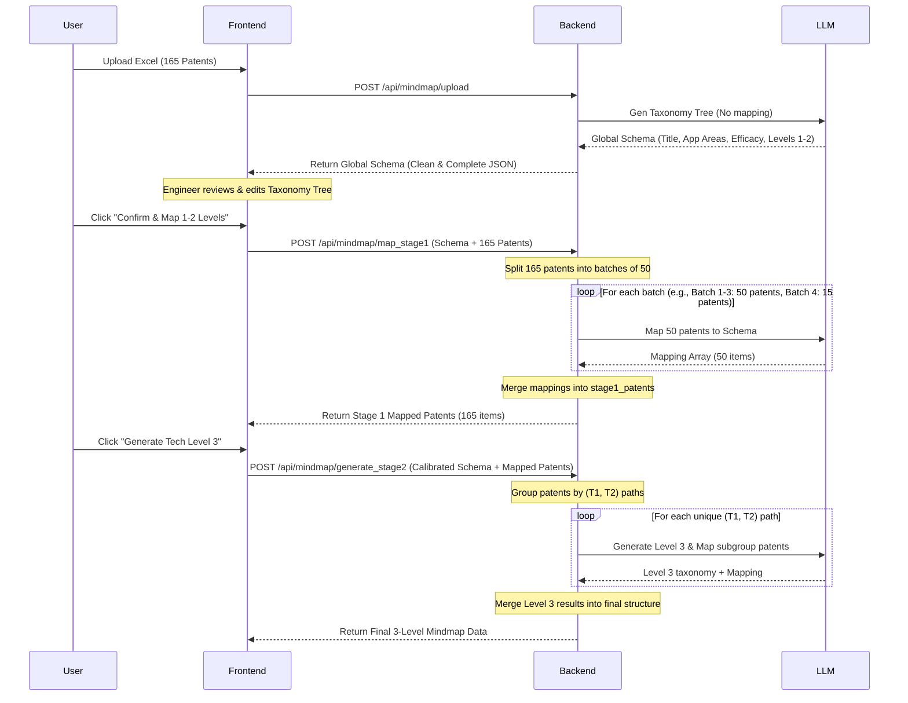

# Refined Two-Stage Patent Mindmap Classification Implementation Plan

This plan describes the refactoring of the patent mindmap classification workflow to handle larger patent lists (e.g., 150+ patents) without hitting LLM output token limits, while maintaining human-in-the-loop calibration.

## Feasibility Analysis
**Yes, this plan is highly feasible.** It separates the heavy token-generating steps (mapping patents to categories) from the schema definition steps. By batching patent mapping calls to 50 patents per request, we guarantee that no single LLM response exceeds the 8,192 token limit. 

## Refined Workflow Architecture

---

## Proposed Changes

### Backend Component

#### [MODIFY] [mindmap_processor.py](file:///e:/Antigravity_Project/Patent%20Analyzer-v02.1/backend/mindmap_processor.py)
* **`query_gemini_stage1`**: Modify the prompt to **only** output the taxonomy structure (`summary_title`, `應用領域`, `功效節點`, `技術樹`) without the `patents` mapping list.
* **[NEW] `/api/mindmap/map_stage1` API endpoint**:
  * Receives the calibrated taxonomy tree and all patent texts.
  * Splits patents into batches of maximum 50.
  * Calls Gemini for each batch to map patents to the pre-defined categories.
  * Merges all mapped patents into a single list and returns it.
* **`generate_stage2`**: Enhance to use the newly batched schema and handle any edge cases where a sub-tree has too many patents (e.g., batching if a single `(T1, T2)` has >40 patents).

---

### Frontend Component

#### [MODIFY] [MindMapTab.jsx](file:///e:/Antigravity_Project/Patent%20Analyzer-v02.1/frontend/src/components/MindMapTab.jsx)
* **`processFile` / `handleUpload`**:
  * Update to handle the mapping-free schema response.
  * Set UI state to `review_stage1` showing the empty calibrated columns.
* **Introduce a new intermediate step (e.g. `mapping_stage1`)**:
  * Add a step between taxonomy editing and Stage 2.
  * When the user clicks the action button, first call `/api/mindmap/map_stage1` to get all patents mapped.
  * Display the mapped patents list in Column 4.
  * Then unlock the "🚀 生成技術 3 階" button to run Stage 2.

---

## Verification Plan

### Automated/Integration Verification
* Upload `test.xlsx` containing 165 patents.
* Verify `/api/mindmap/upload` successfully returns the empty taxonomy object without truncation warnings.
* Perform edits on the frontend UI and submit.
* Verify `/api/mindmap/map_stage1` completes successfully (calling LLM in 4 batches of `[50, 50, 50, 15]`) and returns exactly 165 mapped patents.
* Verify `/api/mindmap/generate_stage2` runs successfully and correctly appends Level 3 mappings.
