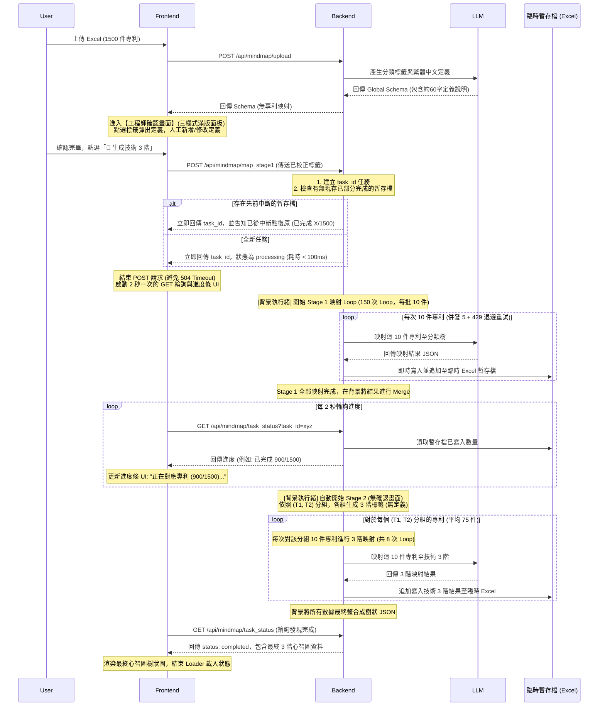

# 專利分類演算法修改評估與實作計畫 (Implementation Plan)

本計畫基於雙方討論之可行建議，針對 **$N=1500$ 件專利** 的量級，重新設計高可用性、防超時、防 Rate Limit 且節省 API 費用的完整實作方案。

---

## 1. 架構核心設計與參數規畫 ($N=1500$)

為了在 $N=1500$ 件專利的高負載下，徹底解決 **504 Gateway Timeout（超時）** 與 **API Rate Limit（限制）**，本方案採用 **「異步背景任務」**、**「10件一小批映射 (Mini-batching)」** 與 **「中斷點暫存 (Checkpointing)」** 三大核心技術：

### 1.1 映射分批與 Loop 參數設計

| 分類階段 | 映射方法 (每次件數) | Loop 總次數 | 後端併發控制 | 預估處理時間 | AI 輸出 Token 數評估 |
| :--- | :--- | :--- | :--- | :--- | :--- |
| **Stage 1 全域映射** | **每批 10 件** 專利 | **150 次 Loop** ($1500 / 10$) | `asyncio.Semaphore(5)` (最大併發為 5) | **約 30 秒** | 每批 10 件映射回傳 JSON 約 250 tokens，遠低於 8,192 限制，**無截斷風險**。 |
| **Stage 2 技術 3 階映射** | 依 `(T1, T2)` 路徑分組後，每組以 **每批 10 件** 進行 3 階映射 | 假設分組為 20 個，每組約 75 件： $20 \times \lceil 75 / 10 \rceil = $ **160 次 Loop** | `asyncio.Semaphore(5)` (最大併發為 5) | **約 35 秒** | 單次 3 階映射回傳 JSON 約 150 tokens，**無截斷風險**。 |

> [!TIP]
> **為什麼選擇「每批 10 件」而不是「1-by-1 (每次1件)」？**
> 1. **節省 API Token 費用**：若採用 1-by-1 映射，每次請求都必須傳送完整的「分類標籤與定義目錄」（約 3,000 tokens）。1500 次呼叫會重複傳送 1500 次，共消耗 **450 萬** 輸入 tokens。改為每批 10 件，API 呼叫次數降為 150 次，僅消耗 **45 萬** 輸入 tokens，**節省 90% 的 API 費用**。
> 2. **降低 Rate Limit 風險**：呼叫次數大幅縮減為 1/10，基本上在付費帳戶下完全不會觸發 TPM/RPM 限制。

---

## 2. 異步任務與暫存復原工作流

### 2.1 系統循序圖

---

## 3. 變更後的前後端實作細節

### 3.1 後端元件修改

#### [MODIFY] [mindmap_processor.py](file:///e:/Antigravity_Project/Patent%20Analyzer-v02.2/backend/mindmap_processor.py)

1. **`query_gemini_stage1`（分類標籤與定義生成）**：
   - 調整 System Prompt，指示 AI 生成「應用領域」、「功效節點」、「技術 1-2 階」分類標籤時，同時為每個標籤產生約 60 字的繁體中文 `定義說明`。

2. **`/api/mindmap/map_stage1`（啟動異步背景任務）**：
   - 接收已校正的 `taxonomy` 與 $N=1500$ 件專利資料。
   - 使用 FastAPI `BackgroundTasks` 在背景啟動 `run_stage1_mapping_task`。
   - **立刻返回**：`{"task_id": "uuid-string", "status": "processing", "completed": 0}`。

3. **背景處理函數（Excel 暫存與中斷點續傳）**：
   - 在 `temp_processing/<task_id>_checkpoint.xlsx` 建立臨時檔案。
   - 若任務啟動時偵測到該檔案已存在，會自動讀取其中已完成的專利號，**跳過重複項目**。
   - 將剩餘專利切成 **每批 10 件**：
     - 使用 `asyncio.Semaphore(5)` 進行併發呼叫。
     - 實作退避重試（Exponential Backoff）：當 API 回傳 `429` 時，自動等待並重試，最高 5 次。
     - 每一批（10件）完成後，即時寫入 Excel 暫存檔。

4. **`generate_stage2`（背景自動銜接 Stage 2）**：
   - Stage 1 結束後，背景自動依 `(T1, T2)` 路徑分組專利。
   - 對每組生成技術 3 階標籤（不含定義）。
   - 對每組專利以 **每批 10 件** 為單位，併發呼叫 API 映射 3 階類別，結果即時更新寫入 Excel 暫存檔。
   - 完成後將任務狀態設為 `completed`。

5. **`/api/mindmap/task_status`（進度輪詢 API）**：
   - 接收 `task_id`，讀取目前暫存 Excel 檔中的記錄筆數，返回當前完成進度與狀態。

6. **`/api/mindmap/export`（下載雙工作表 Excel）**：
   - 使用 `pandas.ExcelWriter` 輸出：
     - **工作表 1 (`專利映射結果`)**：專利映射結果明細。
     - **工作表 2 (`分類標籤定義`)**：三欄 `[分類類型, 分類名稱, 定義說明]`。

---

### 3.2 前端元件修改

#### [MODIFY] [MindMapTab.jsx](file:///e:/Antigravity_Project/Patent%20Analyzer-v02.2/frontend/src/components/MindMapTab.jsx)

1. **`processFile` & `handleReprocess` (跳過初始映射)**：
   - 呼叫上傳或重新分類後，直接進入 `review_stage1` 校正狀態。

2. **確認畫面 UI 調整**：
   - 刪除最右側「專利映射狀態預覽」欄位。
   - CSS 調整為三等分滿版面（應用領域、技術 1-2 階、功效節點）。
   - 點選標籤時，彈出 Modal 視窗顯示與編輯「定義說明」。

3. **輪詢與進度條控制 (`handleGenerateStage2`)**：
   - 點選「🚀 生成技術 3 階」後，切換至處理畫面，發送 POST `/api/mindmap/map_stage1` 取得 `task_id`。
   - 建立 `setInterval` 每 2 秒請求 `/api/mindmap/task_status`。
   - 動態顯示進度：「`正在進行專利映射與技術3階細分 (已完成 X / 1500 件)...`」。
   - 當收到 status 為 `completed` 後，清除 Interval，載入最終心智圖資料。

---

## 4. 驗證計畫 (Verification Plan)

### 4.1 模擬中斷與續傳測試
- 在處理到第 500 件專利時，人工停止後端服務。
- 重新啟動服務並再次提交相同任務，驗證後端是否能自動偵測並讀取 `_checkpoint.xlsx`，直接從第 501 件專利（第 51 批）開始發送 API 請求。

### 4.2 整合超時與 Rate Limit 測試
- 提交 1500 件專利的大檔，確認前端在整個 60 ~ 70 秒的處理期間：
  - **無 504 逾時錯誤**（因為首個 POST 請求在 100ms 內完成）。
  - **進度條平滑更新**。
  - 後端 API 調用日誌中，能成功觸發 Exponential Backoff 處理偶發之 429 Rate Limit。
- 檢查下載之 Excel，驗證 Sheet 2 中的定義說明完全正確。
